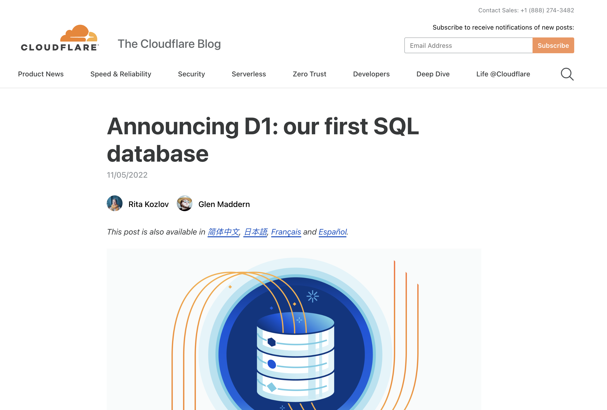

build-lists: true presenter-notes: text-scale(.7), alignment(left), Futura
slide-transition: true

## [fit] The __EDGE__ at your Fingertips,
## Literally!

[.footer: _JSWorld Conference - Amsterdam, June 2022_]
[.footer-style: #2F2F2F, alignment(center), text-scale(1.5)]
---
## What we'll cover?

- What is the Edge?
- How is it different from Serverless Functions?
- Pros & Cons of Serverless & Edge functions.
- The Cloudflare Developer Ecosystem.
- Use Cases and Examples.

[.header: alignment(left), text-scale(1.0)]
[.list: bullet-character(•), alignment(left)]
[.footer: *@lauragift_*]
[.footer-style: alignment(right), text-scale(1.5)]

---

# Gift Egwuenu
### Developer Advocate @Cloudflare
### _Educator_ & _Youtuber_
#### *@lauragift_*
[.header: alignment(left), text-scale(1.0)]
[.text: alignment(left), text-scale(1.0)]
---
# [fit] _What is the_ __Edge___?_

[.footer: *@lauragift_*]
[.footer-style: alignment(right), text-scale(1.5)]
---
<!-- # [fit] _The Edge at your fingertips, Literally!_

[.footer: *@lauragift_*]
[.footer-style: alignment(right), text-scale(1.5)]
--- -->

The edge is a server **geographically** located 
close to your **users**.

[.footer: *@lauragift_*]
[.footer-style: alignment(right), text-scale(1.5)]
---

<!-- [.header: #ddd, alignment(center), text-scale(0.8)] -->
---

### **Where it all started...**
[.footer: *@lauragift_*]
[.footer-style: alignment(right), text-scale(1.5)]
---

--- 

--- 

---
# Limitations of Traditional Servers

- Host your own server.
- High latency.
- Limited opportunity for scaling.
- Expensive to maintain.
  
[.header: alignment(left), text-scale(1.0)]
[.list: bullet-character(•), alignment(left)]
[.footer: *@lauragift_*]
[.footer-style: alignment(right), text-scale(1.5)]
---

### Serverless Functions

[.footer: *@lauragift_*]
[.footer-style: alignment(right), text-scale(1.5)]
---

### Serverless Functions

[.footer: *@lauragift_*]
[.footer-style: alignment(right), text-scale(1.5)]
---
## Advantages of Serverless Functions
- Hosted by a provider, no need to manage your servers.
- Low Costs of Bandwidth.
- Scalibility On Demand.

[.header: alignment(left), text-scale(1.0)]
[.list: bullet-character(•), alignment(left)]
[.footer: *@lauragift_*]
[.footer-style: alignment(right), text-scale(1.5)]
---
## Limitation of Serverless Functions
- All functions are stored in a  centralized core location (us-east1).
- Cold starts after the function is idle. 
- Debugging and Testing is challenging.
  
[.header: alignment(left), text-scale(1.0)]
[.list: bullet-character(•), alignment(left)]
[.footer: *@lauragift_*]
[.footer-style: alignment(right), text-scale(1.5)]
---

## Edge Functions
[.footer: *@lauragift_*]
[.footer-style: alignment(right), text-scale(1.5)]

---
## Edge Functions

### _=_
### **Serverless Functions at The Edge**

[.footer: *@lauragift_*]
[.footer-style: alignment(right), text-scale(1.5)]
---

## Advantages of Edge Functions
- Reduced Latency
- Zero Cold Start
- Enhanced Security and Privacy
- Added Functionality

[.header: alignment(left), text-scale(1.0)]
[.list: bullet-character(•), alignment(left)]
[.footer: *@lauragift_*]
[.footer-style: alignment(right), text-scale(1.5)]
---

## Limitations of Edge Functions
- Low Latency due to Data Storage 
  
[.header: alignment(left), text-scale(1.0)]
[.list: bullet-character(•), alignment(left)]
[.footer: *@lauragift_*]
[.footer-style: alignment(right), text-scale(1.5)]
---

## Cloudflare Developer Platform

[.footer: *@lauragift_*]
[.footer-style: alignment(right), text-scale(1.5)]
---

###  Cloudflare Workers

[.footer: *@lauragift_*]
[.footer-style: alignment(right), text-scale(1.5)]
---
## 

- Goodbye to cold starts—support for **0ms** worldwide.
- Cost Savings - **100,000** request/daily free & affordable plans to scale.
- Edge Storage with KV, Durable Object, R2 & D1.
  
[.header: alignment(left), text-scale(1.0)]
[.list: bullet-character(•), alignment(left)]
[.footer: *@lauragift_*]
[.footer-style: alignment(right), text-scale(1.5)]
---

#### Cloudflare Workers 
### How It Works?

[.footer: *@lauragift_*]
[.footer-style: alignment(right), text-scale(1.5)]
---

[.footer: *@lauragift_*]
[.footer-style: alignment(right), text-scale(1.5)]
---

### Cloudflare Pages Functions

[.footer: *@lauragift_*]
[.footer-style: alignment(right), text-scale(1.5)]
---

[.footer: *@lauragift_*]
[.footer-style: alignment(right), text-scale(1.5)]

---
### Data Storage on the Edge

[.footer: *@lauragift_*]
[.footer-style: alignment(right), text-scale(1.5)]
---

###  Workers KV

[.footer: *@lauragift_*]
[.footer-style: alignment(right), text-scale(1.5)]
---

### Durable Objects

[.footer: *@lauragift_*]
[.footer-style: alignment(right), text-scale(1.5)]
---

### R2

[.footer: *@lauragift_*]
[.footer-style: alignment(right), text-scale(1.5)]
---

---
### Example Use Cases

- Real-time application with Durable Objects and Workers
- A/B Testing
- Custom HTTP Headers & Cookie Management
- IOT / Gaming
- User Authentication and Authourization
- Geolocation Use cases
- Compliance
- Localization and Personalization

[.header: alignment(left), text-scale(1.0)]
[.list: bullet-character(•), alignment(left)]
[.footer: *@lauragift_*]
[.footer-style: alignment(right), text-scale(1.5)]
---

### When **not** to use Cloudflare Workers

- Databases Queries is not hosted...
  
[.header: alignment(left), text-scale(1.0)]
[.list: bullet-character(•), alignment(left)]
[.footer: *@lauragift_*]
[.footer-style: alignment(right), text-scale(1.5)]
---

DEMO.

[.footer: *@lauragift_*]
[.footer-style: alignment(right), text-scale(1.5)]
---
## What we've learned today?

- What is the Edge?
- How is it different from Serverless Functions?
- Pros & Cons of Serverless & Edge functions.
- The Cloudflare Developer Ecosystem (Workers, KV, R2, DO, D1).
- Use Cases & Examples of Edge Functions.

[.header: alignment(left), text-scale(1.0)]
[.list: bullet-character(•), alignment(left)]
[.footer: *@lauragift_*]
[.footer-style: alignment(right), text-scale(1.5)]

---

Building applications on the **Edge** brings us 
closers to the end-users, improving 
the **user's experience** and 
making the web more **accessible**.

[.footer: *@lauragift_*]
[.footer-style: alignment(right), text-scale(1.5)]
---

## Further Resources

- [Cloudflare Workers Documentation](https://developers.cloudflare.com/workers/)
- [Cloudflare Pages Documentation](https://developers.cloudflare.com/pages/)
- Cloudflare Blog - [blog.cloudflare.com](https://blog.cloudflare.com/)
- [Cloudflare Devs Discord](https://discord.com/invite/cloudflaredev/)

[.header: alignment(left), text-scale(1.0)]
[.list: bullet-character(•), alignment(left)]
[.footer: *@lauragift_*]
[.footer-style: alignment(right), text-scale(1.5)]

---
# Thank you!

[.footer: *@lauragift_*]
[.footer-style: alignment(right), text-scale(1.5)]
