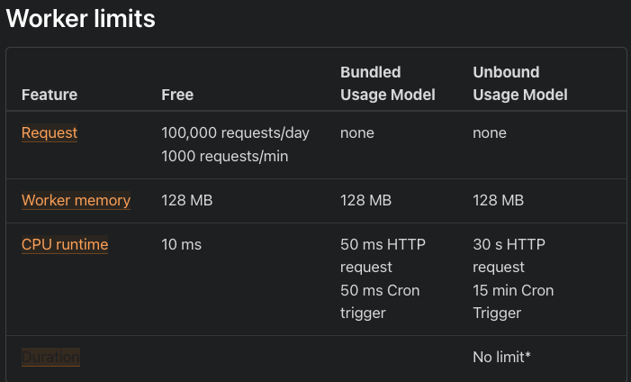

build-lists: true
slide-transition: true

## [fit] The **__EDGE__** at your Fingertips,
## Literally!

[.footer: _JSWorld Conference - Amsterdam, June 2022_]
[.footer-style: alignment(center), text-scale(1.7)]
---
## What we'll cover?

- What is the Edge?
- How is it different from Serverless Functions?
- Pros & Cons of Serverless & Edge functions.
- The Cloudflare Developer Ecosystem.
- Use Cases and Examples.

[.header: alignment(left), text-scale(1.0)]
[.list: bullet-character(•), alignment(left)]
[.footer: *@lauragift_*]
[.footer-style: alignment(right), text-scale(1.5)]

---


# Gift Egwuenu
### Developer Advocate @Cloudflare
### _Educator_ & _Youtuber_
#### *@lauragift_*
[.header: alignment(left), text-scale(1.0)]
[.text: alignment(left), text-scale(1.0)]
---
# [fit] _What is the_ __Edge___?_

[.footer: *@lauragift_*]
[.footer-style: alignment(right), text-scale(1.5)]
---
<!-- # [fit] _The Edge at your fingertips, Literally!_

[.footer: *@lauragift_*]
[.footer-style: alignment(right), text-scale(1.5)]
--- -->

The edge is a server **geographically** located 
close to your **users**.

[.footer: *@lauragift_*]
[.footer-style: alignment(right), text-scale(1.5)]
---


<!-- [.header: #ddd, alignment(center), text-scale(0.8)] -->
---

### **Where it all started...**
[.footer: *@lauragift_*]
[.footer-style: alignment(right), text-scale(1.5)]
---


--- 


--- 


---
# Limitations of Traditional Servers

- Expensive to maintain.
- High latency due to large amount of traffic.
- Limited opportunity for scaling.
  
[.header: alignment(left), text-scale(1.0)]
[.list: bullet-character(•), alignment(left)]
[.footer: *@lauragift_*]
[.footer-style: alignment(right), text-scale(1.5)]
---

## Serverless Functions

[.footer: *@lauragift_*]
[.footer-style: alignment(right), text-scale(1.5)]
---

Serverless doesn't mean **no servers!**

There's still a server, you just don't manage it.

[.footer: *@lauragift_*]
[.footer-style: alignment(right), text-scale(1.5)]
---

## Serverless Providers


[.footer: *@lauragift_*]
[.footer-style: alignment(right), text-scale(1.5)]
---

## Advantages of Serverless Functions
- Hosted by a provider, no need to manage your servers.
- Low costs of bandwidth (pay for only what you use).
- Scalibility On Demand.

[.header: alignment(left), text-scale(1.0)]
[.list: bullet-character(•), alignment(left)]
[.footer: *@lauragift_*]
[.footer-style: alignment(right), text-scale(1.5)]
---
## Limitation of Serverless Functions
- All functions are stored in a  centralized core location (us-east1).
- Cold start after the function is idle. 
- Limited execution time(10ms).
  
[.header: alignment(left), text-scale(1.0)]
[.list: bullet-character(•), alignment(left)]
[.footer: *@lauragift_*]
[.footer-style: alignment(right), text-scale(1.5)]
---

## Edge Functions
[.footer: *@lauragift_*]
[.footer-style: alignment(right), text-scale(1.5)]

---
## Edge Functions

### _=_
### **Serverless Functions at The Edge**

[.footer: *@lauragift_*]
[.footer-style: alignment(right), text-scale(1.5)]
---


## Region Earth
---
### Edge Providers
Cloudflare Workers, 
AWS Lambda@Edge, 
Deno Deploy, 
Netlify Edge Functions

---

## Advantages of Edge Functions
- Reduced Latency
- Zero Cold Start (0ms)
- Improved Application Performace

[.header: alignment(left), text-scale(1.0)]
[.list: bullet-character(•), alignment(left)]
[.footer: *@lauragift_*]
[.footer-style: alignment(right), text-scale(1.5)]
---

### Limitations of Edge Functions
---

- Limited compute resources **(~10 ms)**.

[.list: bullet-character(•), alignment(center)]
[.footer: *@lauragift_*]
[.footer-style: alignment(right), text-scale(1.5)]
---
- No support for browser or Node.js specific features(V8 Engine).

[.list: bullet-character(•), alignment(center)]
[.footer: *@lauragift_*]
[.footer-style: alignment(right), text-scale(1.5)]
---


The best packages and libraries supported by Cloudflare Workers.

---


---

- High latency due to data storage limitations.

[.list: bullet-character(•), alignment(center)]
[.footer: *@lauragift_*]
[.footer-style: alignment(right), text-scale(1.5)]
---

## Cloudflare Developer Platform


[.footer: *@lauragift_*]
[.footer-style: alignment(right), text-scale(1.5)]
---

###  Cloudflare Workers

[.footer: *@lauragift_*]
[.footer-style: alignment(right), text-scale(1.5)]
---

Cloudflare Workers is a serverless execution environment 
that allows you to create new applications 
or augment existing ones 
without configuring or maintaining infrastructure.

---

- Goodbye to cold starts—support for **0ms** worldwide.
  
[.footer: *@lauragift_*]
[.footer-style: alignment(right), text-scale(1.5)]
---

How is a zero cold start possible?


---

How is a zero cold start possible?


---
- Cost Savings - **100,000** request/daily free & affordable plans to scale.
  
[.footer: *@lauragift_*]
[.footer-style: alignment(right), text-scale(1.5)]
---

- Edge Storage with KV, Durable Object, R2 & D1.

[.footer: *@lauragift_*]
[.footer-style: alignment(right), text-scale(1.5)]
---

####  Cloudflare Workers 
### How It Works?

[.footer: *@lauragift_*]
[.footer-style: alignment(right), text-scale(1.5)]
---

- V8 Isolates Engine

[.footer: *@lauragift_*]
[.footer-style: alignment(right), text-scale(1.5)]
---


[.header: #222, line-height(8)]
[.background-color: #FFF]

---

| Virtual Machines | V8 Isolates |
| --- | --- | --- |
| A virtual machine (VM) is a software-based computer that exists within another computer’s operating system. | Isolates are lightweight contexts that group variables with the code allowed to mutate them.| 
| Consumes more memory. | Consumes less memory.  |
| Start-up time 500ms- 10secs. | Start-up time under 5ms. |

[.table-separator: #000000, stroke-width(10)] 
[.text: text-scale(0.7)]
---

## Hello Worker Example

```js
export default {
  fetch() {
    return new Response('Hello Worker!');
  },
};
```
[.header: alignment(left)]
[.footer: *@lauragift_*]
[.footer-style: alignment(right), text-scale(1.5)]
---

###  Pages Functions

[.footer: *@lauragift_*]
[.footer-style: alignment(right), text-scale(1.5)]
---

**Pages** enable you build full-stack applications by executing code on the Cloudflare network with help from **Cloudflare Workers**.

[.footer: *@lauragift_*]
[.footer-style: alignment(right), text-scale(1.5)]
---

##  Functions (Beta)
```js
export async function onRequest(context) {
  // Contents of context object
  const {
    request, // same as existing Worker API
    env, // same as existing Worker API
    params, // if filename includes [id] or [[path]]
    waitUntil, // same as ctx.waitUntil in existing Worker API
    next, // used for middleware or to fetch assets
    data, // arbitrary space for passing data between middlewares
  } = context;

  return new Response("Hello, world!");
}
```
[.footer: *@lauragift_*]
[.footer-style: alignment(right), text-scale(1.5)]

---


### Data Storage on the Edge

[.footer: *@lauragift_*]
[.footer-style: alignment(right), text-scale(1.5)]
---


[.footer: *@lauragift_*]
[.footer-style: alignment(right), text-scale(1.5)]

---

###  Workers KV

[.footer: *@lauragift_*]
[.footer-style: alignment(right), text-scale(1.5)]
---

Workers KV is a global, low-latency, key-value data store.

---

```js
await NAMESPACE.put(key, value);
```

[.code: alignment(center)]
[.footer: *@lauragift_*]
[.footer-style: alignment(right), text-scale(1.5)]
---


```js
await NAMESPACE.get(key);
```

[.code: alignment(center)]
[.footer: *@lauragift_*]
[.footer-style: alignment(right), text-scale(1.5)]
---


```js
await NAMESPACE.delete(key);
```

[.code: alignment(center)]
[.footer: *@lauragift_*]
[.footer-style: alignment(right), text-scale(1.5)]
---


```js
await NAMESPACE.list();
```

[.code: alignment(center)]
[.footer: *@lauragift_*]
[.footer-style: alignment(right), text-scale(1.5)]
---

### Durable Objects

[.footer: *@lauragift_*]
[.footer-style: alignment(right), text-scale(1.5)]
---

**Durable Objects** provide **low-latency** coordination and consistent storage for the Workers platform through two features -
**global uniqueness and a transactional storage API.**

[.footer: *@lauragift_*]
[.footer-style: alignment(right), text-scale(1.5)]
---

```js
export class DurableObject {
  constructor(state, env) {}

  async fetch(request) {
    return Response("Hello World")
  }
}
```

[.footer: *@lauragift_*]
[.footer-style: alignment(right), text-scale(1.5)]
---

### R2

[.footer: *@lauragift_*]
[.footer-style: alignment(right), text-scale(1.5)]
---

R2 storage allows developers to store 
large amounts of **unstructured data** without the 
costly **egress bandwidth fees** associated 
with typical cloud storage services.

[.footer: *@lauragift_*]
[.footer-style: alignment(right), text-scale(1.5)]
---
##  R2 Bindings
```toml
# wrangler.toml
[[r2_buckets]]
binding = 'MY_BUCKET' # <~ valid JavaScript variable name
bucket_name = '<YOUR_BUCKET_NAME>'
```
[.footer: *@lauragift_*]
[.footer-style: alignment(right), text-scale(1.5)]
---


---
### Common Use Cases

- Geolocation Based Redirects
- A/B Testing
- Custom HTTP Headers & Cookie Management
- User Authentication and Authourization
- Localization and Personalization

[.header: alignment(left), text-scale(1.0)]
[.list: bullet-character(•), alignment(left)]
[.footer: *@lauragift_*]
[.footer-style: alignment(right), text-scale(1.5)]
---

### When **~~not~~** to use Cloudflare Workers

---


  
[.footer: *@lauragift_*]
[.footer-style: alignment(right), text-scale(1.5)]
---

### Use Cases ~~wont recommend~~

Data Latency - Database is not hosted on the Edge!

[.list: bullet-character(•), alignment(center)]
[.footer: *@lauragift_*]
[.footer-style: alignment(right), text-scale(1.5)]
---
### Use Cases ~~wont recommend~~

Requires large amount of compute resources to run.



[.list: bullet-character(•), alignment(center)]
[.footer: *@lauragift_*]
[.footer-style: alignment(right), text-scale(1.5)]
---

### **Workers Examples**

[.footer: *@lauragift_*]
[.footer-style: alignment(right), text-scale(1.5)]
---

## Geolocation Based Redirects

[.code-highlight: none]
[.code-highlight: 3]
[.code-highlight: 4-7]
[.code-highlight: all]

```js
export default {
  async fetch(request: Request): Promise<Response> {

    const { cf } = request
    if ( cf?.country === "NL") {
      return Response.redirect("https://asos.com/nl")
    }
  },
};
```

[.footer: *@lauragift_*]
[.footer-style: alignment(right), text-scale(1.5)]
---


## Geolocation Based Redirects

```js
export default {
  async fetch(request: Request): Promise<Response> {
    const { cf } = request
    if ( cf?.country === "NL") {
      return Response.redirect("https://cloudflare.com")
    }
  },
};
```
---

## Retry/Log Failed requests

[.code-highlight: none]
[.code-highlight: 3]
[.code-highlight: all]

```javascript
export default {
  async fetch(request: Request): Promise<Response> {
    const res = await fetch("https://httpstat.us/503?sleep=2000")

    if (!res.ok) {
      return await fetch("https://httpstat.us/200")
    } else {
      return res
    }
  }
}
```

[.footer: *@lauragift_*]
[.footer-style: alignment(right), text-scale(1.5)]
---

## Retry/Log Failed requests


```javascript
export default {
  async fetch(request: Request): Promise<Response> {
    const res = await fetch("https://httpstat.us/503?sleep=2000")

    if (!res.ok) {
      return await fetch("https://httpstat.us/200")
    } else {
      return res
    }
  }
}

```
---

## A/B Testing Remote Origins

[.code-highlight: none]
[.code-highlight: 4-5]
[.code-highlight: 6]
[.code-highlight: 7-11]
[.code-highlight: all]

```js
export default {
  async fetch(request: Request): Promise<Response> {

    const origin1 = 'https://cloudflare.com';
    const origin2 = 'https://jsworldconference.com';
    const randomNumber = Math.floor(Math.random() * 100) + 1;

    if (randomNumber > 50) {
      return fetch(origin1);
    } else {
      return fetch(origin2);
    }
  },
};
```
[.footer: *@lauragift_*]
[.footer-style: alignment(right), text-scale(1.5)]
---


## A/B Testing Remote Origins

```js
export default {
  async fetch(request: Request): Promise<Response> {

    const origin1 = 'https://cloudflare.com';
    const origin2 = 'https://jsworldconference.com';
    const randomNumber = Math.floor(Math.random() * 100) + 1;

    if (randomNumber > 50) {
      return fetch(origin1);
    } else {
      return fetch(origin2);
    }
  },
};
```
---

## What we've learned today?

- What is the Edge?
- How is it different from Serverless Functions?
- Pros & Cons of Serverless & Edge functions.
- The Cloudflare Developer Ecosystem (Workers, KV, R2, DO, D1).
- Use Cases & Examples of Edge Functions.

[.header: alignment(left), text-scale(1.0)]
[.list: bullet-character(•), alignment(left)]
[.footer: *@lauragift_*]
[.footer-style: alignment(right), text-scale(1.5)]

---

Building applications on the **_Edge_** helps bring 
us close to our end-users, improving 
their **_experience_** and making 
the web more **_accessible_ to everyone**.

[.text: text-scale(1.4)]
[.footer: *@lauragift_*]
[.footer-style: alignment(right), text-scale(1.5)]
---

## Further Resources

- [Cloudflare Workers Documentation](https://developers.cloudflare.com/workers/)
- [Cloudflare Pages Documentation](https://developers.cloudflare.com/pages/)
- Cloudflare Blog - [blog.cloudflare.com](https://blog.cloudflare.com/)
- [Cloudflare Devs Discord](https://discord.com/invite/cloudflaredev/)

[.header: alignment(left), text-scale(1.0)]
[.list: bullet-character(•), alignment(left)]
---
# Thank you!

[.footer: *@lauragift_*]
[.footer-style: alignment(right), text-scale(1.5)]
